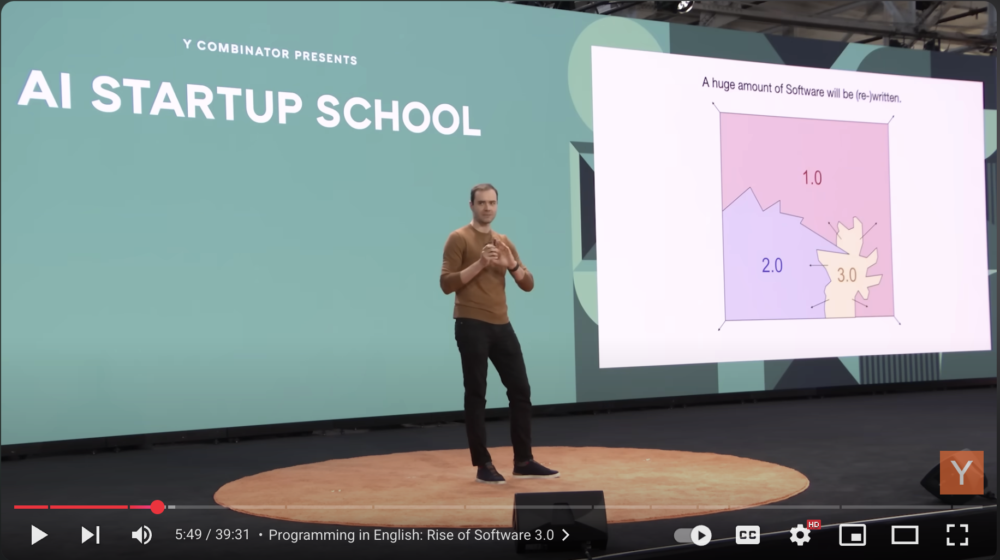

part
part
part

Part 3


## My Thoughts
### How to Organize
Okay, so how should you organize in light of this new change. To Ethans point, organizational structures are trapped in the 1800's and:

```
modern western companies have given up on organizational innovation as something that they do
```

It takes bold brave winners like Answer.AI, Shopify, Cursor and even Google to try new things and not be afraid to throw out some bathwater out.


### Teams / Collaboration

I spoke with several people including `Armin` and it seems at this stage no one knows how best to collaborate with these tools.

He told me about a tool that Mario Zechner <a href="https://x.com/badlogicgames" target="_blank">@badlogicgames</a> was cooking up which lets you share your Claude session context a bit like ChatGPT. You can check it out <a href="https://mariozechner.at/uploads/yakety-claude.html" target="_blank">here</a>.

But in discussing it, the question we both pondered was: 

```
Is it faster to read through some extremely long brain fart context someone else created with their Coding Genie or just summon your own instantly for free?
```

The CEO of `Amp` <a href="https://x.com/sqs" target="_blank">@sqs Quinn Slack</a> was posting on x about a cool feature they have in AMP</a> (an alternative to claude code), for <a href="https://x.com/sqs/status/1939033780326670693">Team thread sharing</a>. I haven't tried it yet, but I intend to.

I no doubt that the next `JIRA` is going to be a totally new tool that blends Agentic Engineering and collaboration.

In the meantime though its not clear exactly how individuals `multi-plexing` across 3-4 things in parallel collaborate, except to break up work and projects in a modular / ecosystem fashion so people don't step on each others toes.

The responsibility in making your code understandable by someone elses Agent is now partially on you're agent, and partially on their agent. Tests, docs and good architecture (even if Agent made) still trump here.


### Hiring and Roles

<a href="https://youtu.be/AUUZuzVHKdo"></a>

You can't hire what you can't name, and there has been a huge shift in traditional titles and the emergence of many new fusion roles.

In a recent interview <a href="https://x.com/satyanadella">Satya Nadella (@satyanadella)</a> the CEO of Microsoft said:
```
At LinkedIn I think they took multiple of these functions, the design function the front-end engineer function the product function put them all together and said we're going to have full stack builders.

That's a change in scope of even a job and so how do you then rebuild the product team with new roles new scopes and what have you.
```

Sataya then goes on to talk about the rise of the FDE.
```
A lot of the AI startups I talk to, everyone has worked at Palantir so, everyone has forward deployment engineers.
```

### Rise of the Builders and FDE's
In another recent <a href="https://youtu.be/DL82mGde6wo">ycombinator podcast</a> from may (called In the Lightcone) with the same excellent host <a href="https://x.com/garrytan">Garry Tan (@garrytan)</a>, they talk about how Palantir invented the `Forward Deployed Engineer` and why so many of their new technical founders are ex-FDE's.

Firstly its worth noting that, <a href="https://x.com/barrald">Barry (@barrald)</a> an ex-FDE has written a blog post talking about <a href="https://www.barry.ooo/posts/fde-culture">why you shouldn't use FDEs in your organization</a>.

However, I think its worth looking at what the emergence of these blended roles like: `full stack builder` and `forward deployed engineer` really means.

OpenAI is deploying FDEs
https://x.com/theinformation/status/1939315431614873961

The goal of a fusion is to take the best qualities of two or more things and produce a new thing.

It is well known that some of the best films are made by individuals who are both `writer` and `director`. Talent like Alex Garland, James Cameron, Christopher Nolan, Taika Waititi and Quentin Tarantino create nothing but gold; and they do it because they have control of both the script and its direction.

As AI helps us to be more effective doing a specific job, it allows us to rise up the stack and take on more scope.

#### So what is an FDE?

- An FDE is an Engineer first
- Makes a good Technical Founder
- Works closely with customers
- Builds custom solutions
- Can Rapidly prototype
- Gathers product feedback
- Is Product Minded
- Is Results Orientated

According to the podcast above, ex-Palantir FDEs are now some of the top Y Combinator founders because they combine the magic of engineering skills and a high bias for action.

The rapid evolution of AI and LLMs makes this model more potent than ever. Founders can have initial meetings with enterprise clients, understand their specific needs, and then quickly `"stuff"` that context into a prompt to create a highly effective, customized demo.

In the podcast they talk about real world examples where a traditional sales team would spend 12 weeks wooing a customer with steakhouses hoping to sign a deal.

Meanwhile the FDE approach meant flying an engineer to literally `"sit next to the FBI Agent"` the domain expert and turn around a working prototype in days. They claim this is the secret to how Palantir crushed its competition.

#### Whats a Full Stack Builder?
The term `fullstack` has been around for a while since the `fusion` of front-end and backend skills or `mobile` and `server`; and has yielded better faster and more cohesive output.

The same way that `devops` surpassed `sysdamin / sysops` as a fusion role.

Builder has become a new term for a very `hacker` (and hackathon) ethos style engineer that is scrappy, hands on and results oriented.

Put that all together and a `full stack builder` is basically someone who can work with any platform or technology, has a high bias toward action and cares about the outcome of the thing being made.


I'd say the `builder` is pretty similar to the `FDE` except there is no emphasis on the client consulting side of things. Builders feel more like your lumberjacks or R&D lab engineers.

FDEs are more like 1 man band, lead singer, solo song writers.


Whos a classic lumberhack!? Geohot.
He said he’s just a max spammer hacker
He’s basically an npc agent with a tight context loop and infinite api token spend and he hacked the iPhone and PlayStation and said he knows nothing “Rick Ruben” about hacking / hardware.


#### What about AI Automation Engineer?

Given how powerful AI is for automation, it seems people are starting to look for specialized talent that can `meta-engineer` the engineering role by using AI to automate `all the things`.

CEO of Quora <a href="https://x.com/adamdangelo">Adam D'Angelo (@adamdangelo)</a> posted a <a href="https://jobs.ashbyhq.com/quora/b0ef4655-20b0-4c4f-93d2-037556c6c9e5">job ad</a> on X.

<blockquote class="twitter-tweet"><p lang="en" dir="ltr">We are opening up a new role at Quora: a single engineer who will use AI to automate manual work across the company and increase employee productivity. I will work closely with this person. <a href="https://t.co/iKurWS6W7v">pic.twitter.com/iKurWS6W7v</a></p>&mdash; Adam D&#39;Angelo (@adamdangelo) <a href="https://twitter.com/adamdangelo/status/1936504553916309617?ref_src=twsrc%5Etfw">June 21, 2025</a></blockquote> <script async src="https://platform.twitter.com/widgets.js" charset="utf-8"></script>

It seems that people are picking up on this high agency, AI first automation engineering culture.


However to Ethans point above, since no one knows yet how to hire native AI talent this poses some interesting challenges. Most playbooks will say just hire smart people regadless, because smart people are smart no matter what their occupation.

If you listen to Cursor's CEO, they still focus very heavily on traditional engineering talent when hiring for their company.

One thing is for sure, you probably want high agency self-walking dogs who aren't afraid of leaping `maximally` into Agentic Engineering workflows.

## Advice for Orgs / Managers

- decide if you are going path A: `more efficient`
- or path B: `bigger`
- tell everyone they will be rewarded for sharing AI efficiency
- roll out AI tools to everyone
    - I suggest an open monthly budget
    - tools change far too often for yearly subs
- buy your staff more time with faster
    - computers
    - internet connections
    - less interruptions
- ~$200-500 USD is probably about right
    - that's nothing if you consider they could be at least 2x+ing their productivity
- reconsider traditional job roles
    - lean into smart high agency people
    - hire domain experts who can close the gap on AI
- flatten structures
- make teams smaller and more autonomous 
- only write job decriptions for things AI can't do in 2 hours
- hire for hybrid / blended roles
    - Forward Deployed Engineer
    - Full Stack Builder
    - AI Automation Engineer
- send your customers FDEs rather than sales people
- get your whole orgs context into a LLM friendly formats and services
- share rewards, more efficiency shouldn't mean more stress and more work


### Advice for Engineers
You are likely to have new team members moving forward who are not human, but agentic `People Spirits` who you `manage` and build `context` for.

As Karpathy says in his <a href="https://www.youtube.com/watch?v=LCEmiRjPEtQ&ab_channel=YCombinator">Software 3.0 video</a> LLMs are "stochastic simulations of people" or "people spirits". This explains their human-like yet imperfect and "jagged" intelligence.

Andrei says people spirits dont have the reliable execution to be trusted, we must build our software with human's in the loop, so its important to:

- create short feedback loops
- protect against `context rot`
- put AI agents on a short leash
- don't generate so much spam you can't review it

Keep that in mind when building software from now on:
- can your system work via curl
- is it easy to copy and paste text from output
- is it open source so the next best LLM knows about it automatically
- are you using things like <a href="https://x.com/jeremyphoward" target="_blank">Jeremy Howard (@jeremyphoward)</a>'s: <a href="https://llmstxt.org/">https://llmstxt.org/</a>

Also don't be dismayed, as Karpathy says this is an "insane" time to be entering the software industry, with a vast amount of work to be done in rewriting existing software and building new, partially autonomous products. 


### Advice for Startups / Business Models
The industry is awash again in crazy valuations and rounds for things people don't get like `Cluey`, raising 15 million from `a16z`.

Someone on twitter recently pointed out that `Cluey` is just Software 3.0 prompts in a desktop app:
<blockquote class="twitter-tweet"><p lang="en" dir="ltr">I reverse engineered <a href="https://twitter.com/cluely?ref_src=twsrc%5Etfw">@cluely</a> – and their desktop source code exposes their entire system prompts and models used.<br><br>What&#39;s inside? 🧵 <a href="https://t.co/y5BcxFjbvB">pic.twitter.com/y5BcxFjbvB</a></p>&mdash; Jack Cable (@jackhcable) <a href="https://twitter.com/jackhcable/status/1936500980297932827?ref_src=twsrc%5Etfw">June 21, 2025</a></blockquote> <script async src="https://platform.twitter.com/widgets.js" charset="utf-8"></script>


You'd think its gold rush time. And it might be.

I do think we should pay heed to the bitter lesson though.

#### The Bitter Lesson

Theres an excellent blog series that came out this year from <a href="https://x.com/lukaspet">Lukas Petersson (@lukaspet)</a> in which he compares the famous <a href="http://www.incompleteideas.net/IncIdeas/BitterLesson.html">`Bitter Lesson` from Rich Sutton</a> to whats happening in the world of AI startups.

<a href="https://lukaspetersson.com/blog/2025/bitter-vertical/">AI Founder's Bitter Lesson. Chapter 1 - History Repeats Itself</a>.

It's worth the read but one thing caught my eye. In chapter 2 he talks about `Helmer’s 7 powers` a framework for thinking about what protective moats a business has.

AI verticals (like Cluely) will struggle to find a moats without any of Helmer’s 7 Powers.
<a href="https://lukaspetersson.com/blog/2025/power-vertical/" target="_blank"></a>

Except one special area of interest the: `Cornered Resource`.

Special access to valuable assets under favorable conditions that create competitive advantage. This could include exclusive rights, patents, or `data`.

Lukas predicts that the only business models safe from AGI systems are ones which have a truly exclusive resource such as a dataset that could only be gathered during a rare event.

While we might be a way off before that happens, its critical to think about the near future as time-line predictions keep getting revised down.

### Agents set us free

Finally, its worth stopping to marvel at what we have collectively built with our ingnenuity and data.

What does the Agentic revolution mean for you?


The builder community on X the likes of the amazing <a href="https://x.com/levelsio" target="_blank"> Pieter Levels (@levelsio)</a> are continually pushing the boundaries of what it means to work. How long before we are all finally untethered from our laptops? 

<div style="transform: scale(0.6); transform-origin: top left; height:800px;">
<blockquote class="twitter-tweet"><p lang="en" dir="ltr">Fixed! <a href="https://twitter.com/VibeTunnel?ref_src=twsrc%5Etfw">@VibeTunnel</a> am i rite! 😜 <a href="https://t.co/pLoyIIrjNv">pic.twitter.com/pLoyIIrjNv</a></p>&mdash; Madhava Jay (@madhavajay) <a href="https://twitter.com/madhavajay/status/1937509169097244876?ref_src=twsrc%5Etfw">June 24, 2025</a></blockquote> <script async src="https://platform.twitter.com/widgets.js" charset="utf-8"></script>
</div>


-------------------------------------

<h2 id="closing-thoughts">Closing Thoughts</h2>

***Everything has changed.***

Do you remember when the inspiring <a href="https://x.com/waitbutwhy">Tim Urban (@waitbutwhy)</a> made this post over (checks notes) 10 years ago.


<a href="https://waitbutwhy.com/2015/01/artificial-intelligence-revolution-1.html"></a>
<a href="https://waitbutwhy.com/2015/01/artificial-intelligence-revolution-1.html">`The AI Revolution: The Road to Superintelligence`</a>


Well this is where we are now:


```running head first into the singularity```

This is probably a moment more significant that `chatgpt` itself. Unlike AI assisting humans, humans assisting AI flips the model and promises to tap into Amdahl's Law and truly multiply every humans efforts. 


There is no longer a `MOAT`. Everyone can be a `G.O.A.T.`

If you have always wanted to create software or nearly anything (lets face it what isn't driven by software now?), now is the time, don't hold back, dive right in.

But Madhava you say: surely I, a non technical person can't learn to cut trees with a chainsaw.

Actually you are wrong. This is exactly what Jeremy Howard did with Fast.AI. He taught an entire generation of domain experts and coders how to use AI and do amazing things (thanks Jeremy ❤️).

In the end, it turns out smart people are smart no matter what their occupation.

The berlin wall of occupational gatekeeping has just started to crack.

### For Orgs
Existing companies need to adapt, and fast. New companies will forge new innovative paths and models of organizing, collaborating and easily outcompete them.

As a company if you reap more efficiency gains, don't forget to share the value back with your employees. That can be through money and it can be through reducing stress and pressure; taking time to breath, live and love! ❤️

<a href="https://gizmodo.com/openai-reportedly-shuts-down-for-a-week-as-zuck-poaches-its-top-talent-2000622145">Even OpenAI is tired and needs a break.</a>

 Deploy AI `maximally` and find those naturals in your existing staff. Follow the lead of companies like Cursor, Shoppify, Answer.AI and now even Google (they're so back), and put your company culture on "low distraction" mode so crafters can "cook".

Every internal obstacle (excessive meetings and document writing) you remove is another multiplier to their productivity prototyping and shipping code.


Listening to all the resources mentioned in this post, and speaking to people about this, it seems no one really knows where this is going; But it’s `green fields` in all directions and the `blue sky` is the `limit`.
<br />
<br />
In the voice of Károly Zsolnai-Fehér from Two Minute Papers:
`"What a time to be alive!"`

<div style="clear: both;"></div>


<br />


<h2 id="twitter-list">List of People to Follow on Twitter</h2>

Agentic Pioneers, Builders and Engineers

<a href="https://x.com/steipete" target="_blank"> Peter Steinberger (@steipete) </a><br />
<a href="https://x.com/mitsuhiko" target="_blank"> Armin Ronacher (@mitsuhiko) </a><br />
<a href="https://x.com/GeoffreyHuntley" target="_blank"> Geoffrey Huntley (@GeoffreyHuntley) </a><br />
<a href="https://x.com/ProgramWithAi" target="_blank"> Manuel Odendahl (@ProgramWithAi) </a><br />
<a href="https://x.com/badlogicgames" target="_blank"> Mario Zechner (@badlogicgames) </a><br />
<a href="https://x.com/iannuttall" target="_blank"> Ian Nuttall (@iannuttall) </a><br />
<a href="https://x.com/jeremyphoward" target="_blank"> Jeremy Howard (@jeremyphoward) </a><br />
<a href="https://x.com/rakyll" target="_blank"> Jaana Dogan (@rakyll) </a><br />
<a href="https://x.com/levelsio" target="_blank"> Pieter Levels (@levelsio) </a><br />
<a href="https://x.com/waghnakh_21" target="_blank"> Mayank Gupta (@waghnakh_21) </a><br />
<a href="https://x.com/swyx" target="_blank"> swyx (@swyx) </a><br />
<a href="https://x.com/sqs" target="_blank"> Quinn Slack (@sqs) </a><br />
<a href="https://x.com/adamdangelo" target="_blank"> Adam D'Angelo (@adamdangelo) </a><br />
<a href="https://x.com/KaiLentit" target="_blank"> Kai Lentit (@KaiLentit) </a><br />
<a href="https://x.com/mntruell" target="_blank"> Michael Truell (@mntruell) </a><br />

Others

<a href="https://x.com/VibeTunnel" target="_blank"> VibeTunnel (@VibeTunnel) </a><br />
<a href="https://x.com/GreatDismal" target="_blank"> William Gibson (@GreatDismal) </a><br />
<a href="https://x.com/mattturck" target="_blank"> Matt Turck (@mattturck) </a><br />
<a href="https://x.com/sjgreggwallace" target="_blank"> Sam Gregg-Wallace (@sjgreggwallace) </a><br />
<a href="https://x.com/petergyang" target="_blank"> Peter Yang (@petergyang) </a><br />
<a href="https://x.com/ArthurMacwaters" target="_blank"> Arthur MacWaters (@ArthurMacwaters) </a><br />
<a href="https://x.com/george__mack" target="_blank"> George Mack (@george__mack) </a><br />
<a href="https://x.com/garrytan" target="_blank"> Garry Tan (@garrytan) </a><br />
<a href="https://x.com/waitbutwhy" target="_blank"> Tim Urban (@waitbutwhy) </a><br />
<a href="https://x.com/reidhoffman" target="_blank">Reid Hoffman (@reidhoffman)</a><br />


<h2 id="references">References</h2>
<a href="https://www.youtube.com/watch?v=6eBSHbLKuN0&ab_channel=Anthropic" target="_blank">Mastering Claude Code in 30 minutes (YouTube)</a><br />
<a href="https://www.youtube.com/watch?v=nfOVgz_omlU&ab_channel=ArminRonacher" target="_blank">Agentic Coding: The Future of Software Development with Agents (Armin Ronacher YouTube)</a><br />
<a href="https://youtu.be/fu7th5HiADo?si=QHpu5nkyZ4tNgM9Z" target="_blank">Interview with Peter Steinberger by Mayank Gupta (YouTube)</a><br />
<a href="https://youtu.be/MbHL0uvKYbE" target="_blank">Answer.AI and Jeremy Howard interview with Matt Turck (YouTube)</a><br />
<a href="https://www.youtube.com/watch?v=KvayXoxzVQw&ab_channel=PeterYang" target="_blank">Shopify Mastery System discussion with Sam Gregg-Wallace (YouTube)</a><br />
<a href="https://youtu.be/oOylEw3tPQ8" target="_blank">Cursor & Michael Truell with Garry Tan: Going Beyond Code (YouTube)</a><br />
<a href="https://youtu.be/DL82mGde6wo" target="_blank">YC Podcast on FDEs and technical founders (YouTube)</a><br />
<a href="https://youtu.be/AUUZuzVHKdo" target="_blank">Satya Nadella on product teams & FDEs (YouTube)</a><br />
<a href="https://youtu.be/LCEmiRjPEtQ" target="_blank">Karpathy: Software is Changing (Again) (YouTube)</a><br />
<a href="https://www.businessinsider.com/microsoft-amazon-google-embrace-flatter-structure-fewer-managers-boost-efficiency-2025-5" target="_blank">Business Insider: Big Tech is crushing middle managers (Article)</a><br />
<a href="http://www.incompleteideas.net/IncIdeas/BitterLesson.html" target="_blank">The Bitter Lesson by Rich Sutton (Article)</a><br />
<a href="https://lukaspetersson.com/blog/2025/bitter-vertical/" target="_blank">Lukas Petersson: AI Founder's Bitter Lesson Ch.2 - Power Vertical (Article)</a><br />
<a href="https://waitbutwhy.com/2015/01/artificial-intelligence-revolution-1.html" target="_blank">Wait But Why: The AI Revolution (Tim Urban Article)</a><br />
<a href="https://gizmodo.com/openai-reportedly-shuts-down-for-a-week-as-zuck-poaches-its-top-talent-2000622145" target="_blank">Gizmodo: OpenAI reportedly shuts down for a week (Article)</a><br />


<h2>Glossary of Terms</h2>
Sound


Glossary of Terms
- context rot:
- path A and path B
- 1 shot
- context window
- COT chain of thought
- jagged intelligence ()
- yolo mode
 I launch Claude Code (released in late February) with --dangerously-skip-permissions, the flag that bypasses all permission prompts. According to Anthropic’s docs, this is meant “only for Docker containers with no internet”, yet it runs perfectly on regular macOS.
https://steipete.me/posts/2025/claude-code-is-my-computer

- prompt injection
https://www.anthropic.com/research/project-vend-1
If Anthropics own Vending machine can be tricked, don't assume your desktop computer can't be

- software 1.0
- sofrware 2.0
- software 3.0
Software 1.0: This is traditional code explicitly written by programmers as instructions for a computer. GitHub is the primary repository for this type of software. 
Software 2.0: This refers to neural networks, where the network's weights are the "code." Instead of writing direct instructions, developers tune datasets and use optimizers to "write" this code. Karpathy equates platforms like Hugging Face to GitHub for Software 2.0. 
Software 3.0: The latest paradigm is driven by Large Language Models (LLMs), which Karpathy describes as a new, programmable kind of computer. In this stage, prompts written in natural language, like English, act as the programs that instruct the LLM. 
- People Spirits:
    karpathy
    we have to learn to work with
    adjust our infrastructure
    "People Spirits": Karpathy refers to LLMs as "stochastic simulations of people" or "people spirits". This explains their human-like yet imperfect and "jagged" intelligence.
programmed in english

Constraining AI for practical use: Karpathy suggests deliberately limiting AI generation to prevent overwhelming human evaluators, a concept he controversially terms putting the LLM on a "short leash"

- "dialogue engineering,"
Jeremys take on fusion tooling

- yolo mode
```
claude --dangerously-skip-permissions`
```

- vibe coding
https://en.wikipedia.org/wiki/Vibe_coding

- 0.1x engineer
The amazing @KaiLentit: 
https://youtu.be/hwG89HH0VcM

- 10x engineer
- 100x engineer
AI agentic engineering meme about 10x engineers

- context engineering
- prompt engineering
    renamed to context engineering

- llms.txt
https://llmstxt.org/

- Karpathy coined Software 3.0



## 📚 Glossary of Terms

### context rot
The phenomenon where an LLM or agent’s short-term memory becomes cluttered with stale or misleading attempts, making it unable to solve problems correctly. Solved by clearing, rewriting, or steering context.

### context window
The maximum amount of text (tokens) an LLM can keep in memory when reasoning. Large context windows allow more history, logs or instructions but risk **context rot**.

### chain of thought (CoT)
A prompting or reasoning technique where the model explicitly lays out intermediate reasoning steps before final answers. Helps with complex tasks.

### jagged intelligence
Coined by Karpathy: LLMs are stochastic “people simulations” — brilliant at times, dumb at others. Their intelligence is uneven, or *jagged*, not uniformly reliable.

### software 1.0
Traditional explicit programming. Humans write deterministic code in Python, Rust, etc. Managed via GitHub.

### software 2.0
Neural networks. The “code” is embedded in weights trained on data. Managed on platforms like Hugging Face.

### software 3.0
LLMs as new programmable computers. Prompts in English are the “programs.” This means humans instruct via natural language, shaping output without direct code.

### prompt engineering → context engineering
The practice of carefully crafting prompts to guide LLM behavior. More recently called *context engineering* to emphasize it’s about curating *all input context* — logs, constraints, data — not just instructions.

### People Spirits
Karpathy’s poetic term for LLMs: “stochastic simulations of people” or “people spirits.” Means they reason like humans — with intuition and errors — requiring collaboration and human oversight.

### vibe coding
A workflow where humans describe what they want in broad, artistic or goal-focused language (“the vibe”), and the LLM writes the technical code. Emphasizes feel over exact implementation.

### dialogue engineering
Jeremy Howard’s term for building advanced tooling to collaboratively solve problems with LLMs, blending the best of notebooks, IDEs, and chat.

### yolo mode
Running Claude Code or similar with `--dangerously-skip-permissions`, removing permission checks for maximum frictionless automation. Powerful but risky.

### slot machine
Metaphor (by @steipete & repeated here) for running LLMs on iterative attempts, pulling the handle repeatedly, hoping for a “1 shot” jackpot solution.

### 1 shot
When an LLM solves a problem fully and correctly on the first try. Rare but highly desirable; often needs many “pulls.”

### Amdahl’s Law
Describes limits on speedup from parallelism: even small serial parts limit scaling. Used here to explain running multiple agentic tasks simultaneously.

### multiplexing
Running multiple independent tasks or projects in parallel, each with an agent, to maximize throughput and increase chances of finding quick wins.

### concurrency
Parallelism in engineering. Running several Claude/LLM tasks at once on different projects or modules to avoid bottlenecks.

### hot reload
Live code reloading without restarting the app. Important for tight feedback loops in agentic coding.

### high agency
Describes people who take initiative, solve problems, and “walk themselves.” Key trait for builders in an agentic future.

### forward deployed engineer (FDE)
Role popularized by Palantir: engineers embedded with customers to quickly build solutions tailored to real needs. Combines engineering, product, and client work.

### full stack builder
Modern fusion role: can work across frontend, backend, devops, even prompt engineering. Hacker ethos, scrappy, bias to action.

### AI automation engineer
Emerging role focusing on using LLMs to automate business processes, workflows, and even engineering tasks.

### bitter lesson
From Rich Sutton: in AI, general methods that scale with compute/data outperform handcrafted solutions. Suggests “vertical” AI startups without exclusive data will struggle.

### cornered resource
A defensible business moat (from Hamilton Helmer’s 7 Powers). In AI, often means exclusive data or user access.

### MCP
Multi-Command Processor — older concept from Anthropic & dev tools (like Playwright MCP for Claude) to coordinate multi-step operations via agents.

### Tokamine / Ultrathinker mode
Cultural slang (from your article & Peter Steinberger) for maxing out LLM usage via all-you-can-eat tokens. Like taking a cognitive stimulant for AI productivity.

### 0.1x engineer / 10x / 100x engineer
Memes about productivity. In the agentic coding era, means those who best orchestrate AI achieve “100x output” by multiplexing with agents.

### Git worktree
A Git feature that lets you check out multiple branches into separate folders sharing the same `.git` history. Ideal for running multiple parallel agent experiments.

### llms.txt
Standard proposed by Jeremy Howard (Answer.AI) for specifying what models, data & parameters were used, to improve reproducibility and let future LLMs understand your software.

### chainsaw metaphor
(Your vivid metaphor) — coding used to require skill like axe work. LLMs are like chainsaws: faster, accessible to all, but dangerous without judgment.

### green fields
Used here to mean the vast new unexplored areas for building products and orgs in this AI paradigm shift.

### slot machine addiction
Running agentic coding tools like Claude repeatedly in a compulsion-like loop, hoping for jackpots. Part meme, part reality.

### context sharing
Sharing an LLM’s live session state (like Yakety Claude) to allow team handoff. Experimental; open question if it’s faster than generating new context.

### People Spirits infrastructure
Karpathy’s idea: we’ll need new software, logs, workflows designed to serve these “stochastic people,” not just humans.

---


### Getting your own Agentic Genie
Skip this if you already have your Agentic Coding slot machine setup.

☑️ 1x General Purpose AI Chat system (LLM)
I prefer ChatGPT Plus because I cannot find a better all-round LLM workhorse chat system that also generates top quality images like ChatGPT does.
Alternatives include: Gemini, Claude etc

This is often a different kind of subscription and doesnt let you use agent coding or other API / command line tools but you can usually access these from a browser and a native phone app and youll spend a lot of time there asking questions and researching things.

☑️ A CLI
You need a command line, all operating systems come with one but some are better than others.
Install one: ask your General Purpose agent above if you don't know how
- GhosTTY (Im loving this right now https://ghostty.org/)
- Warp (great for the average user) https://www.warp.dev/
- Windows: There will be other guides out there but get yourself into WSL2 as quick as you can

☑️ Claude Code
- Install Node JS (ask your General Purpose agent above if you don't know how)
- Then install claude code
https://www.anthropic.com/claude-code


☑️ Get a Max Subscription
If you don't value your own time enough to spend $100 USD per month on a magic genie then infinite software wishes isn't for you.
https://www.anthropic.com/pricing

☑️ Follow the people listed at the bottom
☑️ Watch some of these videos
☑️ Ask Claude to do something
☑️ When you get stuck, ask claude and your General Purpose LLM what to do next
☑️ ... rinse and repeat


<a href="https://x.com/garrytan" target="_blank"> Garry Tan (@garrytan) </a><br />
<a href="https://x.com/waitbutwhy" target="_blank"> Tim Urban (@waitbutwhy) </a><br />
<a href="https://x.com/reidhoffman" target="_blank">Reid Hoffman (@reidhoffman)</a><br />
<a href="https://x.com/KaiLentit" target="_blank"> Kai Lentit (@KaiLentit) </a><br />


<a href="https://x.com/mntruell" target="_blank"> Michael Truell (@mntruell) </a><br />

<a href="https://x.com/mattturck" target="_blank"> Matt Turck (@mattturck) </a><br />
<a href="https://x.com/sjgreggwallace" target="_blank"> Sam Gregg-Wallace (@sjgreggwallace) </a><br />
<a href="https://x.com/petergyang" target="_blank"> Peter Yang (@petergyang) </a><br />
<a href="https://x.com/ArthurMacwaters" target="_blank"> Arthur MacWaters (@ArthurMacwaters) </a><br />
<a href="https://x.com/george__mack" target="_blank"> George Mack (@george__mack) </a><br />

<a href="https://x.com/adamdangelo" target="_blank"> Adam D'Angelo (@adamdangelo) </a><br />
<a href="https://x.com/sqs" target="_blank"> Quinn Slack (@sqs) </a><br />
<a href="https://x.com/rakyll" target="_blank"> Jaana Dogan (@rakyll) </a><br />

<a href="https://x.com/levelsio" target="_blank"> Pieter Levels (@levelsio) </a><br />

<a href="https://x.com/jeremyphoward" target="_blank"> Jeremy Howard (@jeremyphoward) </a><br />


<a href="https://x.com/waghnakh_21" target="_blank"> Mayank Gupta (@waghnakh_21) </a><br />
<a href="https://x.com/swyx" target="_blank"> swyx (@swyx) </a><br />


If you’ve been on the fence about learning to code because you think it will go away, just imagine what engineers will be able to do when they can program AI and robots to do arbitrary work in the real world, that can be you too

Cluely & Soham World


Elegant Puzzle diagram of roles in the AI future?


softwar eating the world, guy who is buying startups and automating them
